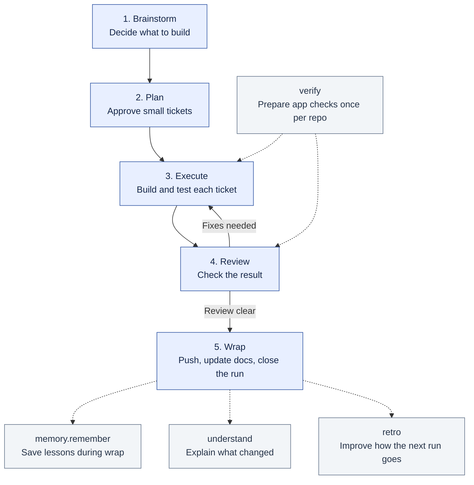

# j-skills

Ten skills for working with coding agents in Claude Code, Codex CLI and GitHub Copilot CLI.
Use `workflow` to take a coding task from idea to reviewed code. Use the other skills when you
need an explanation, app checks, saved lessons or help improving how you work.

**Start with one task. You do not need to run every skill each time.**

[Install the skills](#setup) · [Follow a coding task](#follow-one-task-from-idea-to-done) ·
[Choose a skill](#which-skill-do-i-need) · [Read the details](#skill-reference)

## Start here

After [installation](#setup), open your coding agent in the project you want to work on.
Send this as a chat message:

```text
workflow brainstorm export-csv
I want users to download the current table as a CSV file.
```

`export-csv` is the **run name**, also called a slug. Choose a short name for your own task.
The agent asks questions, saves a brief, and gives you the next command.

Commands in the workflow and skill tables are **messages to your agent**.
The shell blocks under setup and configuration go in a terminal or the named configuration file.
When installed as a plugin, a skill may appear with a prefix such as `j-skills:workflow`.
Use the exact command on the agent's closing card when it includes a prefix.

## How the skills fit together

The solid arrows show the coding steps. Dotted arrows show help used at a particular step.



`workflow` manages all five numbered steps. Ask for `plain` whenever an answer is hard to follow.
For upkeep, use `checkup`, `memory.compact` and `evals` as needed.
`agent-docs` helps when writing instructions that agents will read.

## Follow one task from idea to done

Send **one command at a time**. Wait for the result before continuing.
Keep the same run name throughout.

| Step | Message to send | What you get | Your part |
|---|---|---|---|
| 1. Define the task | `workflow brainstorm export-csv` | A brief describing the problem and expected behaviour | Answer questions and confirm what to build |
| 2. Agree on the work | `workflow plan export-csv` | Usually 2–5 tickets, at most eight, with a check for each | Approve the tickets |
| 3. Build it | `workflow execute export-csv` | Tested changes, one ticket at a time | Try UI changes before their commits; complete any steps assigned to you |
| 4. Check it | `workflow review export-csv` | Findings from a reviewer, normally using a different model vendor | Choose which lower-priority findings to fix |
| 5. Finish it | `workflow wrap export-csv` | Final checks, commits and push, updated docs, saved lessons and a closed run | Follow any remaining requests on the closing card |

Execute handles up to three tickets per session. Repeat it when the closing card says more work remains.
If review finds problems, follow the card through fixes and another review before wrap.
Live or irreversible actions become **operator tickets**, with prepared steps and a record of their result.

Every step ends with a **closing card**. It tells you which model to select, whether to start a
fresh session, and exactly what to send next. Follow it when switching agents or models.
Progress lives in `.workflow/export-csv/`, so a fresh session can resume from the saved files.

| If you need to… | Send |
|---|---|
| Find where you left off | `workflow status` |
| See the next command and model again | `workflow next` |
| Pause the task | `workflow park export-csv` |
| Save an idea for later | `workflow todo Add a PDF export` |
| Improve something that already exists | `workflow improve export-csv - goal: make large exports faster` |

For a new project, `workflow bootstrap` sets up the repo instructions and planning files.
Once the app runs, use `verify.create` to give the agent a repeatable way to drive and check it.
See the [full workflow guide](.github/skills/workflow/README.md) for all commands and
[model routing](.github/skills/workflow/ROUTING.md) for the models used at each step.

## Which skill do I need?

Choose the row that matches your situation. These skills also work outside a workflow run.

| When you need… | Skill | Example message | Result |
|---|---|---|---|
| A coding task planned, built and reviewed | [workflow](#workflow) | `workflow brainstorm export-csv` | A saved run with tickets, checks and review |
| A simpler explanation right now | [plain](#plain) | `plain Why did this test fail?` | A short answer in chat |
| A visual explanation to keep or share | [understand](#understand) | `understand export-csv` | An HTML page with diagrams and source links |
| A repeatable way to check a runnable app | [verify](#verify) | `verify.create` | An app-checking skill and a map of features and how to test them |
| To save a lesson for future sessions | [memory.remember](#memoryremember) | `Remember this: run the API tests with the local test database.` | A memory page linked from `MEMORY.md` |
| To understand why a session was slow | [retro](#retro) | `retro export-csv` | Suggested fixes for the way you work, for you to approve |
| To find problems in the repo or skill setup | [checkup](#checkup) | `checkup` | A read-only health report and suggested actions |
| To tidy repeated or stale memory | [memory.compact](#memorycompact) | `memory.compact` | Proposed memory changes for you to accept |
| To test a new reviewer model | [evals](#evals) | `evals.run reviewer` | Bug-detection and false-alarm results; asks which model to test |
| To write instructions agents can follow | [agent-docs](#agent-docs) | `Use agent-docs to improve this repo's AGENTS.md.` | Guidance for writing and testing the instructions |

### What happens automatically, and what do I ask for?

| Timing | What to use |
|---|---|
| Once the repo has a runnable app | Ask for `verify.create`. Existing verification skill? Use `verify.maintain` instead. |
| During a workflow run | The agent uses `plain` writing rules and the repo's verification skill when available. |
| At wrap | `workflow` calls `memory.remember` to save lessons and updates the verification feature map for changed features. |
| After a run, when useful | Ask for `understand <run-name>` to explain the result, or `retro <run-name>` to improve the process. |
| Whenever upkeep is needed | Ask for `checkup`. Use `memory.compact` for memory cleanup or `verify.maintain` to recheck the feature map. |
| Before changing the reviewer | Run `evals.run reviewer`. It needs the private exam repository described in [setup](#setup). |
| When skills or agent instructions change | `retro` and `memory.remember` load `agent-docs` when needed. You can also request it directly. |

For example, finish `export-csv`, then send `understand export-csv --no-video` to get a visual
explanation. If repeated setup failures slowed the run, send `retro export-csv` too.

## Skill reference

Read the sections below when you need a skill's options, output locations or setup requirements.

### plain

Use it when you switch into a project and need something explained without the jargon.

- **Explain mode** answers a question or re-explains the last message. It starts with one line
  on where you are, then gives the short answer, then more detail only if needed.
- **Rewrite mode** rewrites text or a file so it has no AI patterns. Every fact stays.
- It holds the writing rules that every other skill uses for text you read: short sentences,
  plain words, no em dashes and no parentheses.

### understand

Use it after a finished run, or when you want to learn one part of a codebase.

- It writes one self-contained HTML page with diagrams, decisions and open questions.
- When a run changed what users see, the page shows before and after screenshots. Changes nobody
  asked for come first, marked in red.
- Every claim links to a line of code or a commit, and a checker confirms each link.
- To explain why code looks the way it does, it also reads the review comments on the pull
  requests that shaped it.
- The page goes to `.workflow/<slug>/understand/` for a run, or `docs/understand/<topic>/` for
  an area.
- When the story moves, such as a UI change or a larger feature, it asks whether you also want a
  short animated video: shapes that move one idea at a time, as in 3Blue1Brown, drawn in the
  page's own colours and diagram style, each picture landing on the word that names it. It
  tells one of two stories: what a run built, or why, what and how of a feature. The video
  plays at the top of the page. Add `--video` or `--no-video` to the command to answer in
  advance.
- To share a page as one file, for example in Teams, ask for a standalone copy: the build
  writes `explainer-standalone.html` with a 720p video inside it, about 4 MB for two minutes.
- The video is narrated with ElevenLabs when `ELEVENLABS_API_KEY` is set. Without a key, the
  narration shows as captions on screen. Set `ELEVENLABS_VOICE_ID` to pick another voice.
- To set the key, keep it in its own file and load it near the top of `~/.bashrc`, above any
  line that stops for non-interactive shells. Agents run commands in non-interactive shells,
  so a key loaded below that line never reaches them:

  ```bash
  read -rs KEY && umask 077 && echo "export ELEVENLABS_API_KEY=$KEY" > ~/.config/elevenlabs.env
  unset KEY
  # near the top of ~/.bashrc:
  [[ -f ~/.config/elevenlabs.env ]] && . ~/.config/elevenlabs.env
  ```

  Then restart your agent so it picks up the key.
- Videos need `ffmpeg` and the cairo and pango libraries. Manim, the animation library, installs
  itself on first use into `~/.cache/j-skills/manim-venv`, after you agree.

### workflow

Use it for any coding task bigger than a quick fix.

| Step | What happens |
|---|---|
| Brainstorm | The agent asks questions until the task is clear, then writes a short brief. It builds quick throwaway sketches when trying beats asking |
| Plan | Up to eight small tickets, each with lines that say when it is done |
| Execute | One ticket at a time, test first. Steps only you can take become operator tickets |
| Review | Checks the result where users see it. A model from another vendor reviews the code |
| Wrap | Updates docs and memory, then closes the run |

Each step ends with a card that names the next command and the model to use. Before a step marks
its file complete, `workflow/scripts/check-run.py` checks the run folder's format, so mistakes
in headers, tickets or review notes are caught by a script.
[`ROUTING.md`](.github/skills/workflow/ROUTING.md) sets the models, and the
[workflow guide](.github/skills/workflow/README.md) explains every command.

### retro

Use it after a session that felt slow.

- It finds where the agent lost time: failed commands, long searches, corrections from you.
- It suggests fixes, ranked by how much time they would save.
- Each fix you approve goes to the skill or file that owns it.
- Run `retro` for the current session, `retro <slug>` for a workflow run, or `retro <session id>`.

### memory.remember

Use it at the end of a session, or whenever you say "remember this".

- Each lesson gets its own page in the repo's `memory/` folder, listed in `MEMORY.md`.
- When a lesson comes up again, its page counts it. At three times, the lesson moves into a skill.
- It also updates related docs, such as `DESIGN.md` when the repo has one.

### memory.compact

Use it now and then, when memory feels bloated.

- It merges pages that say the same thing and flags pages that are stale.
- It writes proposals for you to accept. It never changes the memory pages itself.

### checkup

Use it when something feels off, or before a cleanup.

- It checks skills, memory, docs, the workspace, config and how each model performs.
- It only reads. Safe fixes are offered one at a time, and you choose.

### evals

Use it before you let a new model review code, or before you keep a change to the review rules.

- It shows the model up to ten diffs that hide known serious bugs, and records which bugs it finds.
- Each diff also has a clean twin with no bug. A serious bug reported on a clean twin counts as a
  false alarm, so a model that flags everything does not score well.
- Some cases are real bugs a review missed. Others are planted in diffs that already shipped, so
  the exam can run before any real miss happens.
- The cases live in a separate private repo, `j-skills-evals`, because they copy code from your
  repos. See *Setup*.
- Only the reviewer seat is tested this way. Other seats are judged on real runs in `WORKLOG.md`.

### verify

Use it once per repo that has something a user touches: a web page, an app, a CLI or an API.

- `verify.create` builds a skill inside the repo, named `verify-<app>`. It has a small command
  that starts the app, checks it is healthy, clicks or types through it, and takes screenshots.
- It also writes a feature map: for each feature, how a user gets to it and what proves it works.
- `workflow` uses it for before and after screenshots and to check the result in review. Wrap
  updates the map for the features a run changed.
- `verify.maintain` drives every feature again and fixes the map where the app has moved on.
  `checkup` tells you when it is due.
- The skill lives in `.agents/skills/verify-<app>/` with a link in `.claude/skills/`, so all
  three CLIs find it. It is based on pstack's verification skills.

### agent-docs

You rarely start this one yourself. `retro` and `memory.remember` load it when they write for
agents.

- It explains how to write skills, `AGENTS.md` files and memory pages that agents follow reliably.
- It covers the format limits, scripts, testing, and a checklist to run before you ship a skill.
- Its `scripts/trigger-test.py` runs test prompts on all three CLIs and reports which skill each
  one loaded. A skill keeps its test prompts in `tests/triggers.tsv`.

## Setup

The terminal commands below install the skills for Codex and GitHub Copilot. For Claude Code,
use the [workflow guide's folder setup](.github/skills/workflow/README.md#install) for each skill
you want to load. This repo also includes Claude Code plugin discovery links.

Each skill is installed once, as a real folder in `~/.agents/skills/<name>`. The `skills`
installer copies it from GitHub and records it in `~/.agents/.skill-lock.json`. Copilot CLI reads
that folder; Codex reads the same folder through a link in `~/.codex/skills`. These global installs are independent of the working clone, so that clone can live anywhere.

| Path | What it is |
|---|---|
| `~/.agents/skills/<name>` | The installed skill. Copilot CLI and Codex 0.160 or newer read it |
| `~/.codex/skills/<name>` | A link to `~/.agents/skills/<name>`, for Codex |
| `skills/<name>` in this repo | A link for Claude Code plugin discovery, through `.claude-plugin/plugin.json` |

Install every skill:

```sh
npx skills add johnviklund/j-skills -g -a codex github-copilot -s '*' -y
mkdir -p ~/.codex/skills
for n in agent-docs checkup evals memory.compact memory.remember plain retro understand verify workflow; do
  ln -sfn ~/.agents/skills/$n ~/.codex/skills/$n
done
```

Copilot started inside a clone of this repo reads the clone's `.github/skills` instead of the
installed copies. That is how to try an edit before installing it.

The reviewer exam cases live in a private repo, cloned at the fixed path `~/.agents/j-skills-evals`. The
skills find it there because the installed skills are copies, not git checkouts. The cases copy
code from private repos, so they must never go into this public repo:

```sh
gh repo clone johnviklund/j-skills-evals ~/.agents/j-skills-evals
```

### Change a skill

1. Edit the files under `.github/skills/<name>/` in a clone of this repo.
2. Commit and push.
3. Run `npx skills update -g`. It copies the new version into `~/.agents/skills`, and every CLI
   sees it in its next session.

### Add a skill

1. Create `.github/skills/<name>/SKILL.md`.
2. Link it for plugin discovery: `ln -s ../.github/skills/<name> skills/<name>`.
3. Write `tests/triggers.tsv` in the skill folder and run the trigger test:

   ```sh
   python3 .github/skills/agent-docs/scripts/trigger-test.py .github/skills/<name>/tests/triggers.tsv
   ```

4. Commit and push. Install it and link it for Codex, then add its name to the loop above:

   ```sh
   npx skills add johnviklund/j-skills -g -a codex github-copilot -s <name> -y
   ln -s ~/.agents/skills/<name> ~/.codex/skills/<name>
   ```

5. Check that Copilot registered it: `copilot skill list --json | grep '"name": "<name>"'`.

### Keep descriptions short

Copilot silently drops a skill whose `description` is over about 1,000 characters. It shows no
error, and the skill is just missing from `copilot skill list`. Keep each description under 900
characters, and check the list after every change.

## License

MIT, see [`LICENSE`](LICENSE). Notices for adapted work are in
[`THIRD-PARTY-NOTICES.md`](THIRD-PARTY-NOTICES.md).
